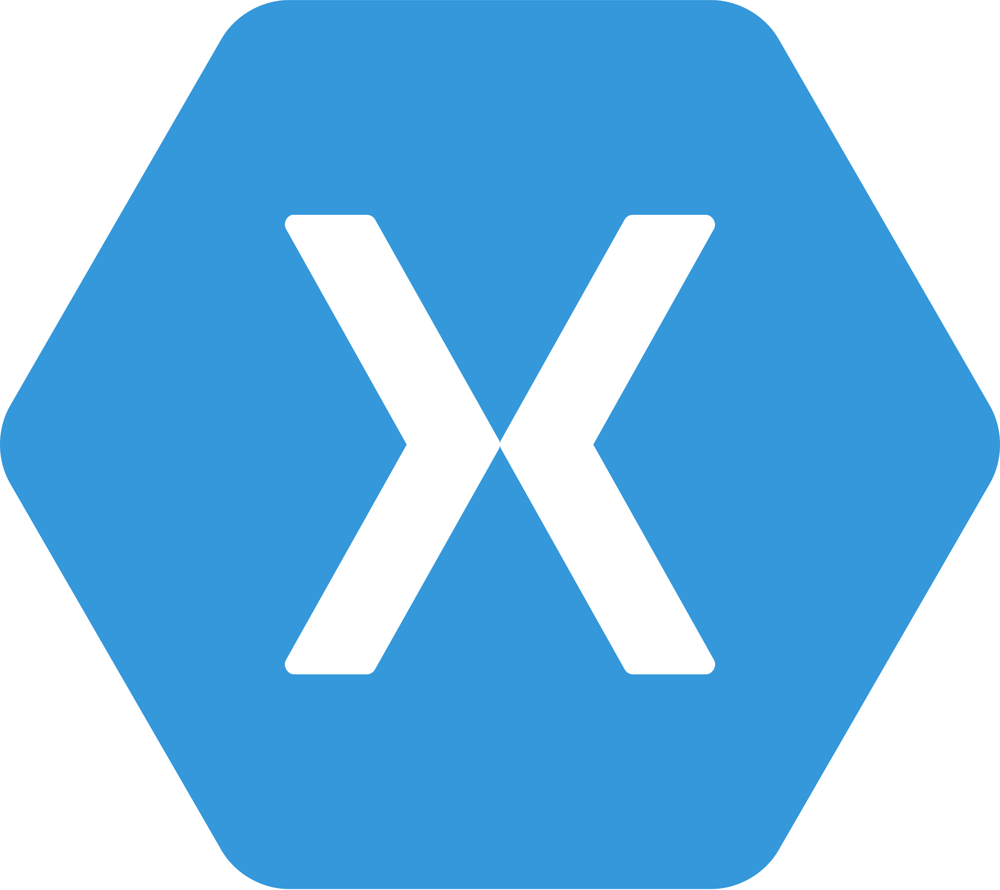

# GigHub App

| Services | Language      | Build Status | Coverage  |
| :-------------|:-------------:| :-----------:| :--------:|
| Android    |  ||
| iOS    |  ||
| Backend    |  ||

The GigHub App is a sample open source application powered by C# and Xamarin, this sample provides us how to build mobile and web applications with a clean architecture and write testable and clean code.

## Using technologies

* Back-end
  * [ASP.NET Web API](https://github.com/jorgecensi/GigHub)
  * ASP.NET Identity 
  * Entity Framework
  * SQL Server
* Xamarin
  * Xamarin.Forms  
  * MVVM  
* Testing
  * BDD Unit testing
  * Moq
  * xUnit (backend)    
* DevOps
  * PowerShell
  * CI (Azure Devops)
  * [Azure Deploy](https://gighub.azurewebsites.net/)  
* Front-end
  * ASP.NET MVC

**Development:**

* [Jorge Censi](https://github.com/jorgecensi)

